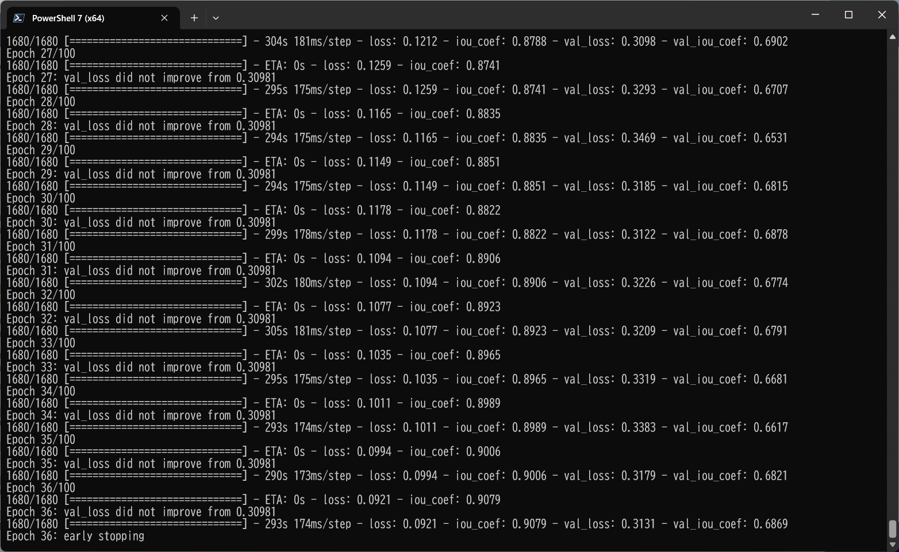
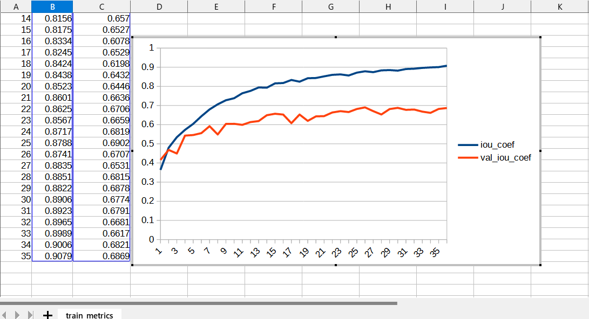
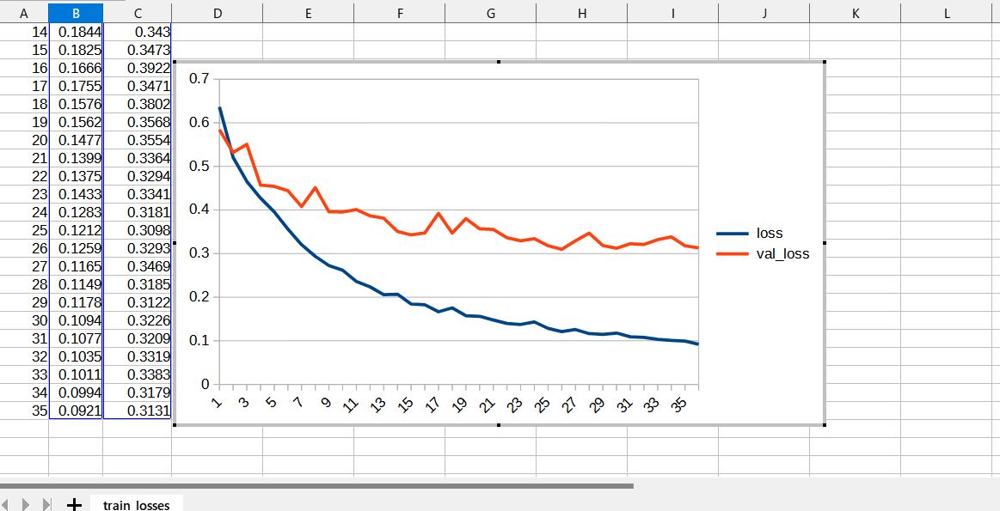
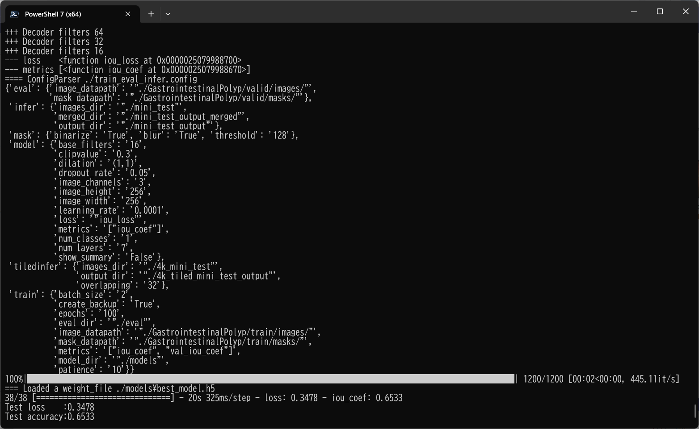
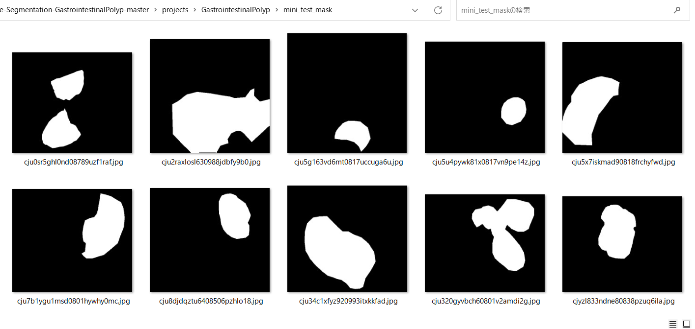
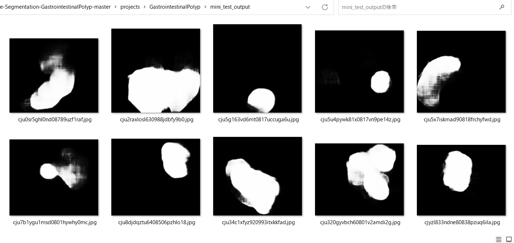

<h2>
TensorflowMultiResUNet-Segmentation-Gastrointestinal-Polyp (Updated: 2023/07/03)
</h2>
This is an experimental project to detect <b>Gastrointestinal-Polyp</b> 
by using <a href="./TensorflowMultiResUNet.py">TensorflowMultiResUNet</a> Model.

In order to write the TensorflowMultiResUNet python class, we have used the Python scripts in the following web sites.

<pre>
1. Semantic-Segmentation-Architecture
 https://github.com/nikhilroxtomar/Semantic-Segmentation-Architecture/blob/main/TensorFlow/multiresunet.py
</pre>

Please see also:

<pre>
2. U-Net: Convolutional Networks for Biomedical Image Segmentation
 https://arxiv.org/pdf/1505.04597.pdf
</pre>
<pre>
3.MultiResUNet : Rethinking the U-Net architecture for multimodal biomedical image segmentation
 https://www.sciencedirect.com/science/article/abs/pii/S0893608019302503
</pre>

The image dataset used here has been taken from the following web site.

<pre>
Kvasir-SEG Data (Polyp segmentation & detection)
https://www.kaggle.com/datasets/debeshjha1/kvasirseg
</pre>

See also: 
<a href="https://github.com/atlan-antillia/Image-Segmentation-Gastrointestinal-Polyp">Image-Segmentation-Gastrointestinal-Polyp</a>
 

<h2>
2 Prepare dataset
</h2>

<h3>
2.1 Download master dataset
</h3>
 Please download the original dataset from the following link 
<pre>
Kvasir-SEG Data (Polyp segmentation & detection)
https://www.kaggle.com/datasets/debeshjha1/kvasirseg
</pre>
<b>Kvasir-SEG</b> dataset has the following folder structure. 
<pre>
Kvasir-SEG
├─annotated_images
├─bbox
├─images
└─masks
</pre>

<h3>
2.2 Create master dataset
</h3>
We have split <b>images</b> and <b>masks</b> dataset in Kvasir-SEG to <b>test</b>, <b>train</b> and <b>valid</b> dataset 
by using Python <a href="./projects/GastrointestinalPolyp/generator/create_master_256x256.py">create_master_256x256.py</a> script,
by which we have also resized all images and masks files in <b>train</b> and <b>valid</b> to be 256x256 and 
applied some rotation and flip operations to the resized images to augment those dataset.    
<pre>
GastrointestinalPolyp
├─test
│  ├─images
│  └─masks
├─train
│  ├─images
│  └─masks
└─valid
    ├─images
    └─masks
</pre>
<b>Augmented image samples: GastrointestinalPolyp/train/images</b> 
 
<b>Augmented mask samples: GastrointestinalPolyp/train/mask</b> 
 

<h3>
3 TensorflowMultiResUNet class
</h3>
We have defined <a href="./TensorflowMultiResUNet.py">TensorflowMultiResUNet</a> class as a subclass of <a href="./TensorflowUNet.py">TensorflowUNet</a> class. A <b>create</b> method in that class has been taken from 
<pre>
Semantic-Segmentation-Architecture
 https://github.com/nikhilroxtomar/Semantic-Segmentation-Architecture/blob/main/TensorFlow/multiresunet.py
</pre>

<h2>
4 Train TensorflowMultiResUNet Model
</h2>
 We have trained Gastrointestinal Polyp <a href="./TensorflowMultiResUNet.py">TensorflowMultiResUNet</a> Model by using the following
 <b>train_eval_infer.config</b> file.  
Please move to <b>./projects/GastrointestinalPolyp</b> directory, and run the following train bat file. 
<pre>
>1.train.bat
</pre>
, which simply runs the following command. 
<pre>
>python ../../TensorflowMultiResUNetTrainer.py train_eval_infer.config
</pre>
, where train_eval_infer.config is the following.
<pre>
; train_eval_infer.config
; 2023/7/4 antillia.com

[model]
image_width    = 256
image_height   = 256
image_channels = 3
num_classes    = 1
base_filters   = 16
num_layers     = 7
dropout_rate   = 0.05
learning_rate  = 0.0001
dilation       = (1,1)
clipvalue      = 0.3
loss           = "iou_loss"
metrics        = ["iou_coef"]
show_summary   = False

[train]
epochs        = 100
batch_size    = 2
patience      = 10
metrics       = ["iou_coef", "val_iou_coef"]
model_dir     = "./models"
eval_dir      = "./eval"
image_datapath = "./GastrointestinalPolyp/train/images/"
mask_datapath  = "./GastrointestinalPolyp/train/masks/"
create_backup  = True

[eval]
image_datapath = "./GastrointestinalPolyp/valid/images/"
mask_datapath  = "./GastrointestinalPolyp/valid/masks/"

[infer] 
images_dir    = "./mini_test" 
output_dir    = "./mini_test_output"
merged_dir    = "./mini_test_output_merged"

[tiledinfer] 
overlapping = 32
images_dir = "./mini_test"
output_dir = "./tiled_mini_test_output"

[mask]
blur      = True
binarize  = True
threshold = 128
</pre>

Since <pre>loss = "iou_loss"</pre> and <pre>metrics = ["iou_coef"] </pre> are specified 
in <b>train_eval_infer.config</b> file,
<b>iou_loss</b> and <b>iou_coef</b> functions are used to compile our model as shown below.
<pre>
    # Read a loss function name from a config file, and eval it.
    # loss = "bce_iou_loss"
    self.loss  = eval(self.config.get(MODEL, "loss"))

    # Read a list of metrics function names from a config file, and eval each of the list,
    # metrics = ["binary_accuracy"]
    metrics  = self.config.get(MODEL, "metrics")
    self.metrics = []
    for metric in metrics:
      self.metrics.append(eval(metric))
    self.model.compile(optimizer = self.optimizer, loss= self.loss, metrics = self.metrics)
</pre>
You can also specify other loss and metrics functions in the config file. 
Example: basnet_hybrid_loss(https://arxiv.org/pdf/2101.04704.pdf) 
<pre>
loss         = "basnet_hybrid_loss"
metrics      = ["dice_coef", "sensitivity", "specificity"]
</pre>
On detail of these functions, please refer to <a href="./losses.py">losses.py</a> , and 
<a href="https://github.com/shruti-jadon/Semantic-Segmentation-Loss-Functions/tree/master">Semantic-Segmentation-Loss-Functions (SemSegLoss)</a>.

We have also used Python <a href="./ImageMaskDataset.py">ImageMaskDataset.py</a> script to create
train and test dataset from the <b>GastrointestinalPolyp</b> dataset specified by
<b>image_datapath</b> and <b>mask_datapath </b> parameters in the configratration file. 

<b>Train console output</b> 
 
 
The <b>val_accuracy</b> is very high as shown below from the beginning of the training. 
<b>Train accuracies line graph</b>: 
 

 
The val_loss is also very low as shown below from the beginning of the training. 
<b>Train losses line graph</b>: 
 

<h2>
5 Evaluation 
</h2>
We have tried to evaluate the segmented region for <b>./GastrointestinalPolyp/valid</b> dataset 
 by using our Pretrained  GastrointestinalPolyp Model. 
<pre>
>2.evaluate.bat
</pre>
, which simply runs the following command. 
<pre>
>python ../../TensorflowMultiResUNetEvaluator.py train_eval_infer.config
</pre>
<b>Evaluate console output</b> 
 
 

<h2>
6 Inference 
</h2>
We have also tried to infer the segmented region for <b>mini_test</b> dataset, which is a very small dataset including only 
ten images extracted from <b>test</b> dataset,
 by using our Pretrained  GastrointestinalPolyp Model. 
<pre>
>3.infer.bat
</pre>
, which simply runs the following command. 
<pre>
>python ../../TensorflowMultiResUNetInferencer.py train_eval_infer.config
</pre>

<b>Input images (mini_test) </b> 
 
 

<b>Ground truth mask (mini_test_mask) </b> 
 
 

<b>Inferred images (mini_test_output)</b> 
Some white polyp regions in the original images of the mini_test dataset above have been detected as shown below.
 
 
<b>Merged inferred images blended with the orignal images and inferred images</b> 
  

 
<!--
-->

<h3>
References
</h3>

<b>1.MultiResUNet : Rethinking the U-Net architecture for multimodal biomedical image segmentation</b> 
Nabil Ibtehaz, M. Sohel Rahman 
<pre>
 https://www.sciencedirect.com/science/article/abs/pii/S0893608019302503
</pre>

<b>2. Semantic-Segmentation-Architecture</b> 
<pre>
 https://github.com/nikhilroxtomar/Semantic-Segmentation-Architecture/blob/main/TensorFlow/multiresunet.py
</pre>

<b>3. Kvasir-SEG Data (Polyp segmentation & detection)</b> 
<pre>
https://www.kaggle.com/datasets/debeshjha1/kvasirseg
</pre>

<b>4. Kvasir-SEG: A Segmented Polyp Dataset</b> 
Debesh Jha, Pia H. Smedsrud, Michael A. Riegler, P˚al Halvorsen, 
Thomas de Lange, Dag Johansen, and H˚avard D. Johansen 
<pre>
https://arxiv.org/pdf/1911.07069v1.pdf
</pre>
